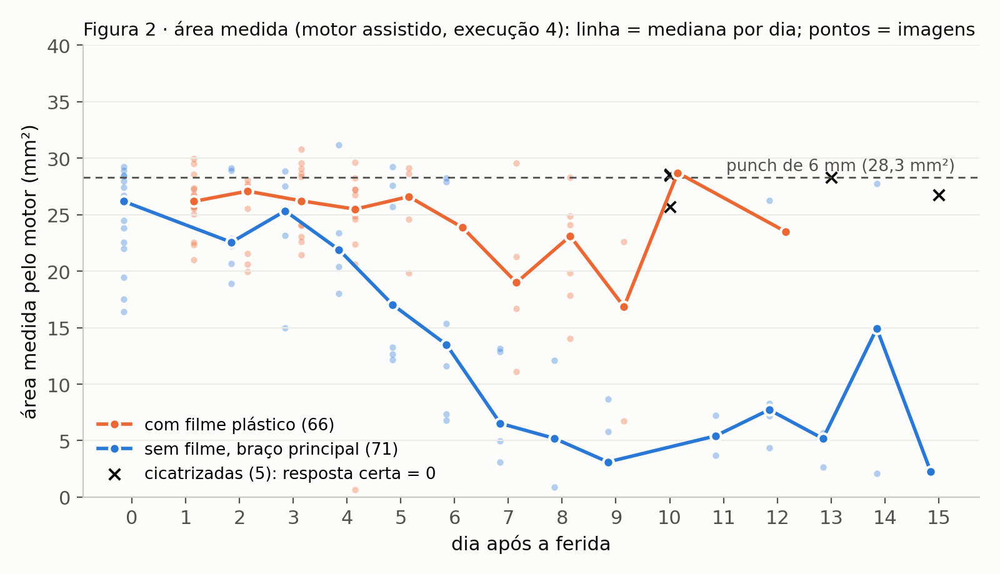
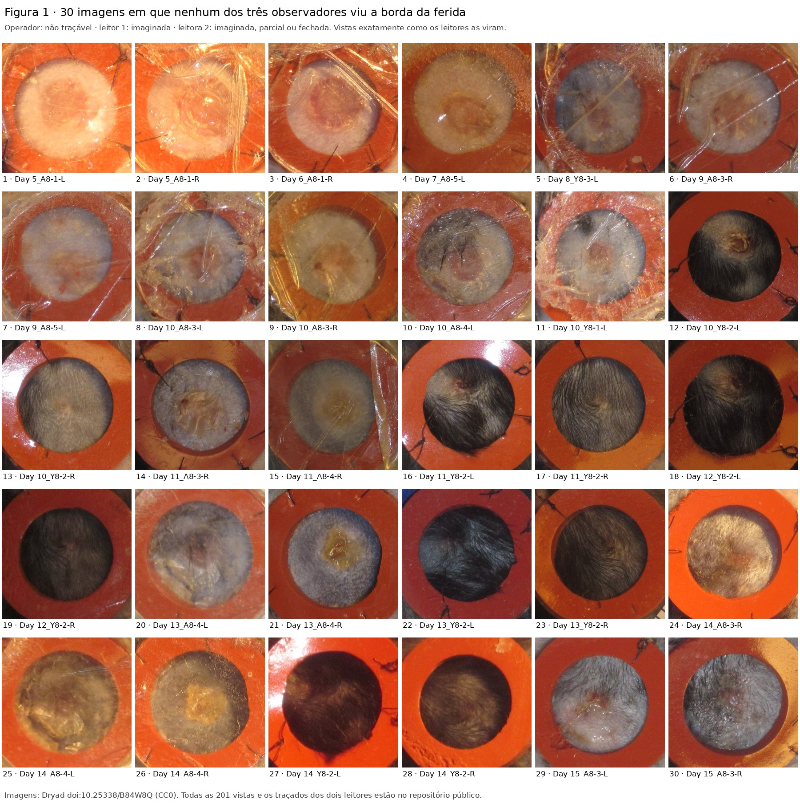

# Nem toda ferida fotografada pode ser medida: traçabilidade, regra escrita e dois leitores cegos em um banco público de feridas de camundongo

**Rascunho v2 · 04/10/2026** · revisado por conferência independente de cada número · não submetido

Fabio da Camara Oliveira Ferreira¹ (ORCID 0009-0009-0997-3275)

¹ Pesquisador independente, Águas de Lindóia, SP, Brasil. fabiohumaniza@gmail.com

---

## RESUMO

**Introdução.** Estudos que medem feridas em fotografia costumam relatar a
concordância contra um traçado de referência, sem dizer se a borda era visível
em cada imagem. Quando a borda não é visível, o traçado de referência é um
palpite, e a concordância contra ele não mede acerto.

**Objetivo.** Testar, com previsões registradas antes de cada execução, uma
regra escrita e congelada de detecção de borda (motor v0, desenvolvida em
modelo suíno) em um banco público de feridas de camundongo. Medir também
quantas imagens permitem traçar a borda.

**Métodos.**
- **Banco:** 255 fotografias de 16 feridas excisionais de 8 camundongos,
  fotografadas entre os dias 0 e 15 (Dryad, doi:10.25338/B84W8Q).
- **Escala e área:** a escala foi medida à mão no anel de silicone (splint).
  A área de busca foi restrita ao interior do anel, num círculo colocado à mão
  e registrado com hash antes de qualquer execução que o usasse.
- **Classificação:** o operador classificou cada imagem quanto à
  traçabilidade da borda e declarou os artefatos.
- **Referência:** dois leitores, um leigo e uma enfermeira, traçaram, cegos e
  com ordens diferentes,
  as mesmas 201 imagens. Em cada imagem, cada um declarou se viu a borda, se
  viu parte dela ou se a imaginou.
- **Métrica:** Dice no quadro inteiro, sempre ao lado de um comparador nulo
  (círculo do tamanho do punch no centro do anel).

**Resultados.**
- **Sem restrição de área, o motor falhou** (ρ de Spearman entre dia e área
  = −0,16; previsto ≤ −0,8). Com a área fixada no interior do anel, a curva das
  imagens sem filme plástico caiu (motor sozinho, ρ = −0,86). Na medida
  assistida (campo mais a declaração do operador), a área foi de 26,2 mm² no
  dia 0 a 3 a 8 mm² nos dias 7 a 13 (ρ = −0,88).
- **Contra os leitores, nas imagens em que cada um viu a borda**, a mediana
  do Dice do motor foi:

  | leitor | Dice motor | Dice nulo |
  |---|---|---|
  | leitor 1 | 0,899 (n = 48) | 0,602 |
  | leitor 2 | 0,906 (n = 44) | 0,651 |

- **Nas 55 imagens em que os dois leitores viram a borda:**

  | comparação | Dice |
  |---|---|
  | leitor 1 × leitora 2 | 0,976 |
  | motor × leitor 1 | 0,922 |
  | motor × leitora 2 | 0,919 |
  | nulo × leitores | 0,80 |

- **Onde a borda foi imaginada**, o Dice do motor caiu:

  | leitor | Dice motor | Dice nulo |
  |---|---|---|
  | leitor 1 | 0,51 | 0,50 |
  | leitora 2 | 0,75 | 0,57 |
- **Traçabilidade:**
  - os leitores concordaram entre si sobre quais imagens são traçáveis
    (κ = 0,69);
  - nenhuma imagem que um viu com clareza o outro marcou como imaginada;
  - com o operador, a concordância foi menor (κ 0,36 a 0,41).
- **Imagens não mensuráveis:**
  - o operador julgou não mensuráveis 64 de 201 imagens com campo (32 %),
    antes de qualquer traçado humano;
  - os leitores marcaram como "vi a borda" no máximo uma delas.
- **Cicatrizadas:** nas 5 imagens julgadas cicatrizadas pelo operador, o motor
  mediu área do tamanho do punch.

**Conclusão.** Onde a borda é visível, uma regra escrita, sem treino nesse
banco, fica perto da concordância entre leitores humanos. Onde não é visível,
nenhum método pode ser avaliado contra traçado, e a imagem deve ser relatada
como não mensurável, não medida.

**Palavras-chave:** cicatrização de feridas; fotografia; segmentação de
imagem; reprodutibilidade; pré-registro; camundongo.

---

## 1 · INTRODUÇÃO

Medir a área de uma ferida por fotografia é rotina em pesquisa e começa a ser
rotina na clínica. A forma habitual de validar um método é compará-lo a um
traçado humano de referência, pelo coeficiente de Dice ou pela correlação de
áreas.

Essa validação pressupõe que a borda esteja visível. Em fotografia de ferida,
muitas vezes não está. Ela pode estar coberta por:
- curativo plástico;
- reflexo;
- pelo que volta a crescer;
- crosta;
- sangue.

Em modelos experimentais, o próprio anel que imobiliza a pele pode cobrir
parte da ferida. Quando a borda não é visível, quem traça imagina onde ela
está. Um método que concorde com esse traçado concorda com um palpite.

O banco público de feridas de camundongo de Carrión et al. (2022) ilustra bem
o problema.
- **Os próprios autores** listam, entre as dificuldades das imagens:
  - leito ocluído por cobertura plástica, reflexo e sujeira;
  - borrão;
  - pelo que volta a crescer;
  - anel ausente ou muito danificado em mais de 25 % das imagens.
- **No trabalho original:**
  - um anotador leigo traçou um polígono em todas as imagens;
  - uma rede neural foi treinada sobre esse traçado;
  - o Dice relatado no conjunto de teste foi 0,8665.
- **O que não foi relatado:** em quantas imagens a borda era visível.

Neste trabalho, a mesma pergunta foi feita de outro jeito. Primeiro, quantas
imagens permitem traçar a borda. Depois, quanto uma regra escrita concorda com
leitores humanos nessas imagens, e onde ela falha. O método é uma regra de detecção de borda por
anel fechado, desenvolvida e publicada para modelo suíno (Ferreira, 2026,
doi:10.5281/zenodo.23062849). Ela foi aplicada **congelada**: nenhuma
constante foi alterada. Cada execução teve as previsões registradas antes, em
repositório público com hash. Os fracassos foram publicados junto com os
acertos.

## 2 · MÉTODOS

### 2.1 · Registro e transparência

Todo o trabalho foi registrado em uma sequência de adendos datados, cada um
com o hash SHA-256 dos arquivos que fixa. O código, os dados derivados e os
adendos estão em repositório público. Nenhum arquivo com hash foi alterado
depois de registrado: correções foram para arquivos novos.

Cada execução do motor foi precedida da publicação:
- do código;
- das entradas;
- das previsões, com critério de acerto numérico.

### 2.2 · O banco

O banco tem 255 fotografias, disponíveis no Dryad (doi:10.25338/B84W8Q):
- **8 camundongos**, 4 jovens (Y8-1 a Y8-4) e 4 idosos (A8-1, A8-3, A8-4 e
  A8-5);
- **16 feridas**, duas por animal, uma de cada lado (L e R), feitas com punch
  de 6 mm (28,27 mm²);
- cada ferida com anel de silicone (splint) suturado em volta;
- **dias de fotografia:** 0 a 15.

Nenhuma imagem foi excluída do conjunto de partida.

### 2.3 · Escala

O operador mediu o diâmetro interno do anel em cada imagem, com quatro cliques
em cruz e uma regra escrita: média das duas maiores distâncias. O erro dessa
regra foi medido nos próprios cliques, contra um círculo ajustado por mínimos
quadrados:
- mediana −0,20 %;
- **sempre negativa**, por construção.

Das 255 imagens, **204** tinham anel medível e **51** não tinham anel visível.
Cinco imagens medidas duas vezes, em dias diferentes, variaram entre −1,9 % e
+0,6 %.

### 2.4 · Classificação e área de busca

**Classificação, antes de qualquer execução do motor.** O operador marcou
cada imagem como:
- laudável;
- duvidosa;
- não laudável;
- cicatrizada;
- com ou sem filme plástico.

As 9 imagens marcadas como cicatrizadas nessa etapa não tinham anel visível e
não chegaram às 201. As **"limpas"** (laudáveis e sem filme) são 70: são o
conjunto em que foram descritas as execuções 1 a 3.

**O campo de busca.** O operador colocou, em cada uma das 204 imagens com
escala, um círculo encostado na borda interna do anel, sem tocá-lo. O campo é
esse círculo encolhido 0,3 mm, margem fixada antes da primeira imagem.
- 201 imagens receberam campo;
- 3 não couberam, todas da mesma ferida, com o plástico deformado;
- o raio mediano do campo foi de 3,99 mm.

O campo foi registrado com hash antes de qualquer execução que o usasse.

**A declaração do operador.** Na fase final, o operador marcou cada uma das
201 imagens:

| estado | n | o que significa |
|---|---|---|
| sem nada a corrigir | 81 | — |
| com correção | 56 | conta-gotas na cor da ferida e/ou contorno de artefato |
| não traçável | 49 | — |
| borda parcial | 11 | — |
| pelo sobre o leito | 4 | — |

A regra de traçabilidade foi escrita assim: *"a borda pode ser seguida com
confiança na maior parte da volta"*.

**Quando a declaração foi feita.** O operador fez a declaração depois de ter
visto as máscaras da execução 3 nas 201 imagens, e antes de qualquer traçado
humano e da execução 4.

**As cicatrizadas.** Cinco imagens descritas como "cicatrizada" ou "fechada"
na nota do operador estão entre as 49 não traçáveis. Elas formam um braço
exploratório em que a resposta certa é área zero.

**Os braços de análise:**
- **principal:** as imagens medidas pelo operador (sem nada a corrigir ou com
  correção) e sem filme plástico (71);
- **com filme:** exploratório (66).

### 2.5 · O motor

O motor v0 é a regra de anel fechado publicada para modelo suíno, sem nenhuma
constante alterada. Os módulos foram lidos do local onde foram congelados, com
o hash conferido a cada execução.

Foram feitas quatro execuções, cada uma com pré-registro próprio:

| execução | o que muda |
|---|---|
| 1 | foto, sem restrição de área |
| 2 | a coroa do anel é excluída da busca |
| 3 | só o campo declarado (§2.4) |
| 4 | o campo, mais a declaração do operador (cores e artefatos) |

A execução 3 é o motor sozinho dentro do campo. A execução 4 é a medida
assistida.

### 2.6 · Os leitores

Dois leitores traçaram a borda da ferida nas 201 imagens com campo.

- **Leitor 1:** bacharel em ciência da computação, com dois anos de veterinária
  e parente do autor.
- **Leitora 2:** enfermeira, ex-diretora de Saúde de Águas de Lindóia (SP)
  (COREN-SP 115508); foi chefe do autor na Secretaria de Saúde do
  município, sem vínculo de trabalho atual entre os dois [confirmar].

**A condução da leitura.** O autor esteve presente durante parte do traçado do
leitor 1. Numa ocasião, o leitor pediu que uma imagem fosse mostrada ao
assistente de IA usado no projeto, que se recusou a comentar.

**O painel.** Cada leitor recebeu o mesmo painel em navegador:
- as mesmas vistas, conferidas pelo SHA-256 de cada imagem;
- sem nome, dia ou máscara;
- em **ordem sorteada própria**, com semente registrada.

**A declaração inicial.** Antes de começar, cada leitor declarou não ter visto
as imagens, traçados de outra pessoa ou de máquina, nem expectativas.

**A instrução:**
- traçar a borda da parte vermelha ou rosada;
- ignorar o anel, a sutura, o pelo e o brilho;
- traçar **todas** as imagens, inclusive imaginando a borda;
- em cada imagem, declarar uma de quatro opções: vi a borda (TRACADA), vi
  parte (PARCIAL), imaginei (IMAGINADA) ou ferida fechada (FECHADA).

A hora de abrir e de fechar cada imagem foi gravada. Cada arquivo de traçado
foi lacrado com hash antes de ser aberto.

**Mudança de protocolo, declarada.** A primeira versão do painel pedia para
traçar só o que fosse visível. Ela foi trocada pela atual (traçar todas,
declarando o que foi imaginado) antes de qualquer traçado, mas depois de o
autor ter visto as execuções 3 e 4.

### 2.7 · Métricas e análise

**O Dice.** Calculado no quadro inteiro de 700 px, sem recortar pelo campo:
se o leitor traçou fora do campo, isso conta contra o motor.

**O comparador nulo.** Todo Dice foi relatado ao lado de um nulo: um círculo
do tamanho do punch no centro do anel, desenhado sem olhar a imagem.

**O conjunto principal.** As imagens do braço principal que o leitor marcou
como TRACADA. As demais foram relatadas à parte, sem veredito.

**Concordância de traçabilidade.** Medida pelo kappa de Cohen, com a
classificação "TRACADA ou não", entre:
- os dois leitores;
- cada leitor e o operador.

### 2.8 · Comparação com o trabalho original

O caderno público do trabalho original lista 32 imagens numa pasta chamada
`test_images`. Não se sabe se essa pasta é o conjunto do Dice relatado no
artigo:
- as 32 imagens cobrem as 16 feridas, duas de cada;
- o artigo descreve uma divisão por ferida, com 2 feridas de teste;
- os traçados de referência do trabalho original não são públicos.

O Dice do motor foi calculado nessas imagens, onde elas estavam entre as 201.
A comparação foi registrada antes de ser feita.

## 3 · RESULTADOS

### 3.1 · Sem restrição de área, o motor falhou

**Execução 1.** O motor devolveu medida em todas as 255 imagens, sem recusar
nenhuma. A curva de área por dia não caiu (ρ = −0,16; previsto ≤ −0,8). Nas
imagens limpas, **nenhuma** das 70 máscaras estava dentro do anel: o motor
mediu o próprio anel e o pelo em volta.

**Execução 2.** Com a coroa do anel excluída, o motor migrou para o pelo, a
luva e a régua. Só 26 de 70 máscaras caíram dentro do anel.

Esse foi um erro de método do autor, não do motor nem do banco: o estudo de
origem mede **só** dentro do anel. O código dele:
- recorta a imagem com o anel no centro;
- fica com a mancha de ferida mais próxima do centro;
- calcula a área em relação ao interior do anel.

A área de busca foi então fixada no interior do anel (§2.4), antes das
execuções seguintes.

### 3.2 · Com a área fixada, a curva caiu

**Execução 3.** Todas as 70 máscaras das imagens limpas ficaram dentro do
campo. Nas imagens sem filme, a curva caiu (ρ = −0,86). Com filme plástico, a
curva ficou reta, em torno de 26 mm², do primeiro ao último dia: **o plástico
trava o número**.

Área mediana da execução 3 no dia 0, nas limpas: 27,2 mm² (96 % do punch).

**Execução 4** (medida assistida), braço principal (71 imagens):
- área mediana de 26,2 mm² no dia 0 (93 % do punch);
- 3,1 a 7,7 mm² entre os dias 7 e 13;
- ρ = −0,88.

**O efeito da correção do operador.** Das 56 imagens corrigidas, 24 saíram
praticamente iguais à execução 3 (Dice ≥ 0,95 entre as duas máscaras). A
previsão de que pelo menos metade sairia igual falhou.

### 3.3 · Contra os leitores

**Tabela 1.** Mediana do Dice do motor contra cada leitor.

| conjunto | leitor | n | motor assistido (exec. 4) | motor sozinho (exec. 3) | nulo |
|---|---|---|---|---|---|
| principal, borda vista | 1 | 48 | **0,899** | 0,895 | 0,602 |
| principal, borda vista | 2 | 44 | **0,906** | 0,887 | 0,651 |
| com filme, borda vista | 1 | 23 | 0,941 | 0,935 | 0,856 |
| com filme, borda vista | 2 | 22 | 0,946 | 0,945 | 0,855 |
| todas as traçadas | 1 | 200 | 0,845 | 0,814 | 0,700 |
| todas as traçadas | 2 | 194 | 0,834 | 0,807 | 0,692 |
| só as imaginadas | 1 | 45 | 0,511 | 0,475 | 0,496 |
| só as imaginadas | 2 | 47 | 0,750 | 0,667 | 0,568 |

As quatro previsões registradas para os leitores se confirmaram:

| previsão | critério | leitor 1 | leitor 2 |
|---|---|---|---|
| mediana | ≥ 0,70 | 0,899 | 0,906 |
| fração das imagens com Dice ≥ 0,70 | ≥ 80 % | 90 % | 86 % |

A previsão de que o leitor 2 daria resultado igual ao do leitor 1 (0,899 ±
0,05) também se confirmou.

O que a tabela mostra:
- **A correção do operador quase não mudou a concordância** nas imagens com
  borda visível: 0,899 com correção e 0,895 sem, no leitor 1. Onde a borda é
  visível, o motor sozinho já concorda com os leitores.
- **Com filme plástico, o nulo já chega a 0,86.** Ali, um Dice alto do motor
  diz pouco.

**Tempo de leitura:**

| leitor | mediana por imagem | total |
|---|---|---|
| 1 | 35 s | 145 min, com uma pausa |
| 2 | 21 s | 83 min |

### 3.4 · Os dois leitores concordam entre si

- **Nas 55 imagens que os dois marcaram como TRACADA**, o Dice entre os dois
  traçados teve mediana de **0,976**. Nas mesmas 55, a mediana foi:

  | comparação | Dice |
  |---|---|
  | motor × leitor 1 | 0,922 |
  | motor × leitora 2 | 0,919 |
  | nulo | 0,80 |

  Das 55, 17 têm filme plástico.
- **Nas 138 imagens em que ao menos um leitor não marcou TRACADA**, os dois
  traçados ainda coincidiram muito (Dice 0,947). Mesmo onde imaginaram a
  borda, os dois imaginaram parecido, provavelmente guiados pelo anel e pela
  forma esperada da ferida.
- **O kappa de traçabilidade entre os dois foi 0,69.** Nenhuma imagem que um
  leitor marcou como TRACADA o outro marcou como IMAGINADA (Tabela 2).
- **Contra o operador**, a concordância foi menor (κ 0,41 e 0,36). Os leitores
  foram mais rigorosos: das 137 imagens que o operador mediu, cada leitor
  julgou ver a borda em cerca de metade.
- **Das 64 imagens que o operador excluiu**, o leitor 1 não marcou nenhuma como
  TRACADA, e o leitor 2 marcou uma.

**Tabela 2.** Estado declarado pelo leitor 1 (linhas) × pelo leitor 2 (colunas).

| | TRACADA | PARCIAL | IMAGINADA | FECHADA |
|---|---|---|---|---|
| TRACADA | 55 | 16 | 0 | 0 |
| PARCIAL | 12 | 51 | 20 | 1 |
| IMAGINADA | 0 | 12 | 27 | 6 |
| FECHADA | 0 | 1 | 0 | 0 |

### 3.5 · As imagens em que ninguém viu a borda inteira

**Como as 30 foram escolhidas.** A regra, aplicada depois do traçado do
leitor 1, juntou as imagens que **o operador julgou não traçáveis e o leitor 1
marcou como imaginadas**. A leitora 2, que traçou depois e sem saber dessa
seleção, é a única checagem independente. Ela não marcou nenhuma das 30 como
"vi a borda":

| observador | como classificou essas 30 |
|---|---|
| operador | não traçável |
| leitor 1 | imaginada |
| leitora 2 | imaginada (19), parcial (5) ou fechada (6); nenhuma como TRACADA |

Os motivos descritos nas notas foram:
- filme plástico cobrindo ou deformando a borda;
- pelo sobre o leito;
- artefato atravessando a lesão;
- borda que se confunde com cicatriz;
- segunda ferida ao lado.

**Três das 30 estão entre as cinco que o operador julgou cicatrizadas.**

Nessas imagens, o Dice do motor contra o traçado imaginado teve mediana de:

| leitor | n | Dice motor | Dice nulo |
|---|---|---|---|
| leitor 1 | 30 | 0,37 | 0,35 |
| leitora 2 | 24, sem as 6 fechadas | 0,48 | 0,50 |

O motor não faz melhor que o nulo. Resultado exploratório.

**As 30 imagens estão na Figura 1, abertas ao leitor**, exatamente como os
leitores as viram. A Tabela S1 traz, para as 201 imagens, a classificação e a
nota de cada um dos três observadores. **Convidamos quem discordar a tentar
traçá-las.** Todas as vistas, os traçados e o painel usado pelos leitores
estão no repositório público. Uma ferramenta pública para essa tentativa está
descrita em Disponibilidade de dados.

### 3.6 · Imagens julgadas cicatrizadas

Nas cinco imagens que o operador julgou cicatrizadas, a resposta certa é área
zero. Os leitores não foram unânimes:

| leitor | FECHADA | PARCIAL | IMAGINADA |
|---|---|---|---|
| leitor 1 | 1 | 1 | 3 |
| leitora 2 | 3 | 1 | 1 | **O motor deu entre 25,7 e 28,6 mm²**, o tamanho do punch. O motor v0
não sabe dizer "não há ferida". Diante de pele fechada, ele acha um contorno
do tamanho que espera achar.

### 3.7 · No conjunto de teste do trabalho original

Das 32 imagens de teste do trabalho original, 26 estão entre as 201. Três
estão entre as 30 da Figura 1.

| conjunto | n | Dice do motor, média | Dice do motor, mediana |
|---|---|---|---|
| imagens em que o leitor 1 viu a borda | 8 | **0,908** | 0,932 |
| todas, incluindo as imaginadas | 26 | 0,764 | 0,852 |

O valor relatado no trabalho original foi 0,8665. A comparação não é direta:
- o anotador é outro;
- lá havia uma rede treinada, aqui uma regra que nunca viu o leitor;
- o Dice original foi calculado no recorte de 352 px centrado no anel, e o
  nosso no quadro inteiro;
- não se sabe se as 32 imagens são o conjunto do Dice relatado (§2.8).

## 4 · DISCUSSÃO

**O principal achado é anterior a qualquer número de concordância: nem toda
ferida fotografada pode ser medida.**
- Neste banco, o operador julgou não mensurável cerca de um terço das imagens
  com campo.
- Os dois leitores foram ainda mais rigorosos, mas confirmaram a exclusão: das
  64 imagens excluídas pelo operador, marcaram no máximo uma como "vi a borda".
- Nessas imagens, o traçado é um palpite. Os dois leitores imaginaram de forma
  parecida (Dice 0,947), mas um motor que concorde com esse palpite não está
  medindo a ferida: o motor não superou o nulo ali.
- Um estudo que traça todas as imagens e relata um Dice só mistura medida com
  palpite.

**Onde a borda é visível, a regra escrita concorda com os leitores.** Nas 55
imagens em que os dois viram a borda, a mediana foi:

| comparação | Dice |
|---|---|
| motor × leitor 1 | 0,92 |
| motor × leitora 2 | 0,92 |
| entre os próprios leitores | 0,98 |
| nulo | 0,80 |

Os cerca de 0,06 que separam o motor dos leitores são o quanto falta à regra
para igualar uma pessoa nessas imagens. A regra:
- não foi treinada neste banco;
- não tem nenhuma constante ajustada para camundongo;
- foi desenvolvida em modelo suíno.

**A restrição de área não é ajuste: é a condição de uso.** Sem ela, o motor
mediu o anel e o pelo. Com ela, mediu a ferida. O estudo de origem faz a mesma
restrição, por construção. O primeiro resultado, o fracasso, é relatado como
resultado negativo.

**O comparador nulo separa o que o Dice sozinho esconde.** Com filme plástico,
um círculo cego já chega a 0,86. Nessas imagens, um Dice alto não mostra
nada.

**A limitação mais séria é o caso da ferida cicatrizada.** O motor v0 sempre
encontra um contorno. Um sistema clínico precisa saber dizer "não há o que
medir". Essa é a primeira prioridade da versão seguinte.

### Limitações

- **Nenhum leitor é especialista em feridas.** O leitor 1 é parente do autor,
  e o autor esteve presente em parte da leitura dele. A leitora 2 foi chefe do
  autor. Um leigo e uma enfermeira concordaram 0,98 entre si, o que sugere
  que a tarefa, onde a borda é visível, não exige especialista. Mas isso não
  substitui um leitor especialista.
- **O operador que colocou o campo e fez a declaração já tinha visto as
  imagens e as máscaras da execução 3.** A execução 4 é uma medida assistida,
  não automática.
- **A regra de traçabilidade foi aplicada por uma pessoa.**
  - Entre operador e leitores, a concordância foi moderada (κ 0,36 a 0,41). Os
    leitores foram mais rigorosos que o operador.
  - Entre os dois leitores, a concordância foi boa (κ 0,69).
  - Uma regra de traçabilidade aplicável sem juízo humano é trabalho futuro.
- **As 30 imagens da Figura 1 foram escolhidas pelo operador e pelo leitor 1;**
  só a leitora 2 é checagem independente delas.
- **O braço principal tem 71 imagens,** com poucas por dia nos dias finais.
- **Não há medida física independente da área ao longo dos dias.** Só o
  punch, no dia 0.

## 5 · CONCLUSÃO

Em um banco público de feridas de camundongo, uma regra escrita e congelada,
desenvolvida em outra espécie:
- concordou com dois leitores cegos, um leigo e uma enfermeira, nas imagens
  em que a borda era visível;
  - Dice de 0,90 a 0,92, contra 0,98 entre os próprios leitores e 0,80 do
    nulo;
- seguiu uma curva de área compatível com o fechamento da ferida.

Cerca de um terço das imagens não permitiu traçar a borda. Para essas imagens,
o resultado honesto é "não mensurável", e ele deveria ser relatado em qualquer
estudo de medida de ferida por fotografia.

---

## DISPONIBILIDADE DE DADOS E CÓDIGO

O repositório público reúne:
- código;
- dados derivados (escala, campo, classificação, declaração, máscaras e
  traçados dos dois leitores);
- 61 adendos com hash, nas pastas `camundongo/rodada2`, `camundongo/emenda4`
  e `camundongo/emenda5`.

- **Repositório:** https://github.com/fabiohumaniza-cyber/deolhonapele (ramo
  `emenda2-camundongo`, pasta `camundongo/emenda5`). DOI do Zenodo a inserir na
  submissão.
- **Imagens originais:** Dryad (doi:10.25338/B84W8Q).
- **Desafio aberto:** as 30 imagens da Figura 1 podem ser tentadas por
  qualquer pessoa em https://fabiohumaniza-cyber.github.io/deolhonapele/desafio_borda.html.
  O participante:
  - se identifica (nome, profissão, instituição e e-mail);
  - declara responder sozinho e sem ter visto as imagens;
  - em cada imagem, tenta traçar a borda e responde se consegue traçá-la com
    certeza.

  Nada é enviado automaticamente. As respostas recebidas por e-mail e
  confirmadas com o participante serão relatadas em adendo público.

## AGRADECIMENTOS

Aos autores do banco público de feridas de camundongo (Yang, Bagood, Carrión,
Isseroff e colaboradores), por disponibilizá-lo. Aos dois leitores, Emílio da Camara Oliveira Ferreira e Helga Emanuele Resquioto
(enfermeira, COREN-SP 115508), que traçaram as 201 imagens.

**Compensação.** A segunda leitora recebeu compensação fixa pelo tempo,
combinada antes da leitura e independente do resultado.

## CONFLITO DE INTERESSES

O autor é titular de pedido de patente do método (BR 10 2026 024571 2) e de
registro de programa de computador (512026008413-0).

## REFERÊNCIAS (a completar)

1. Carrión H, Jafari M, Bagood MD, Yang HY, Isseroff RR, Gomez M. Automatic wound detection and size estimation using deep learning algorithms. *PLoS Comput Biol.* 2022;18(3):e1009852.
2. Ferreira FCO. A borda da ferida existe na fotografia: medição auditável baseada em regras em relação a um padrão físico em um modelo suíno (versão v5n). Zenodo; 2026. doi:10.5281/zenodo.23062849.
3. Banco Dryad: doi:10.25338/B84W8Q.
